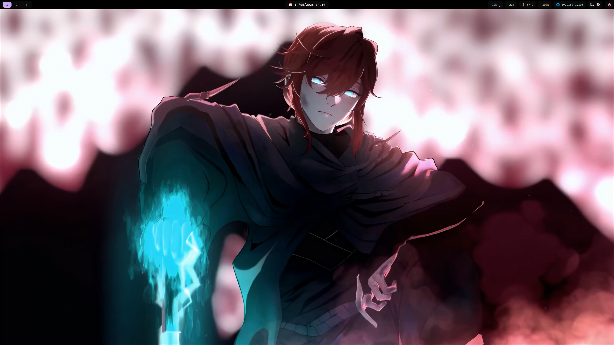
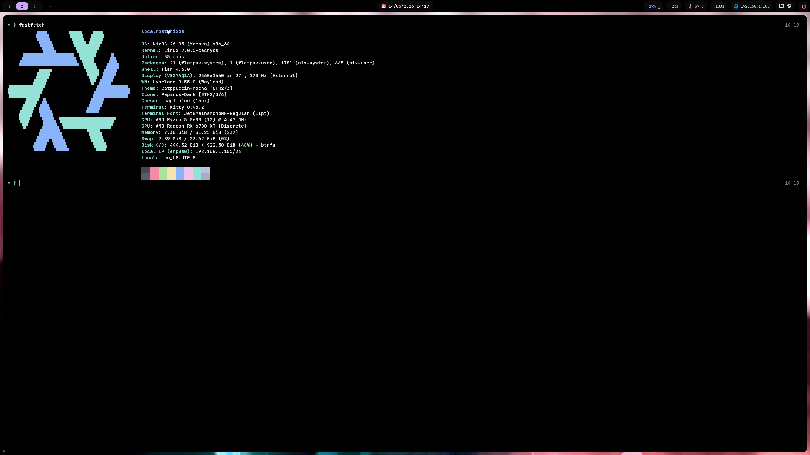

# 🚀 NixOS Hyprland + VFIO

<p align="center">
  ⚡ Declarative • 🎮 Gaming • 🧪 VFIO • 🐧 NixOS
</p>

<p align="center">
  
  
  <br/>
  Built for ultra-low latency Linux gaming and single-GPU virtualization.
</p>

---

AMD-optimized declarative gaming setup featuring:

- Hyprland Wayland desktop
- Low-latency gaming stack
- Hardware-agnostic Reflex / Anti-Lag 2
- Single-GPU VFIO passthrough
- Fully declarative NixOS configuration

> ⚠️ Advanced setup — intended for users familiar with NixOS, Wayland, virtualization and Linux system internals.

---

# ✨ Features

## ⚙️ Kernel & System

- CachyOS BORE kernel
- AMD optimized boot parameters:
  - `amd_pstate=active`
  - `amd_iommu=on`
  - `iommu=pt`
  - `amdgpu.ppfeaturemask=0xfffd7fff`
- Desktop responsiveness tuning:
  - `rcupdate.rcu_expedited=1`
  - `nowatchdog`
  - `nmi_watchdog=0`
- AppArmor enabled
- systemd initrd
- dbus-broker

### BORE Scheduler

Improves:
- desktop responsiveness
- frame pacing
- input latency
- scheduling under gaming load

---

# 🎮 Gaming Stack

## Core

- Steam
- Proton-GE
- Heroic Games Launcher
- MangoHud
- Gamescope
- GameMode
- ProtonUp-Qt

## Low Latency Layer

Hardware-agnostic Vulkan latency layer:

- Global Reflex support
- NVIDIA spoofing for compatibility
- Vulkan injection layer

```bash
LOW_LATENCY_LAYER_REFLEX=1
LOW_LATENCY_LAYER_SPOOF_NVIDIA=1
```

### RADV Anti-Lag

```bash
RADV_ANTILAG=1
```

### Vulkan Tweaks

```bash
AMD_VULKAN_ICD=RADV
RADV_PERFTEST=gpl,nggc
```

### lsfg-vk

Vulkan frame generation support.

---

# 🖥️ Hyprland Desktop

- Hyprland 0.55+
- Wayland-only environment
- greetd + tuigreet
- Waybar
- Dunst
- Rofi
- Hypridle
- Hyprlock
- mpvpaper

```ini
allow_tearing = true
vrr = 2
```

---

# 🔊 Audio

PipeWire low-latency:

- 48kHz
- quantum = 128
- ALSA / Pulse / JACK support
- WirePlumber
- rtkit

---

# 💾 Storage

## LUKS2 + Btrfs

- Full disk encryption
- Snapper snapshots
- Monthly scrub
- zram swap

### Subvolumes

- `@`
- `@home`
- `@nix`
- `@log`
- `@snapshots`

---

# 🤖 AI Integration

- Ollama (ROCm acceleration)
- Local LLM support

---

# 🖥️ VFIO / GPU Passthrough

Single-GPU passthrough setup:

### VM Start
- stop display manager
- unbind amdgpu
- bind vfio-pci
- launch VM

### VM Stop
- rebind amdgpu
- restart display manager

> Host screen will go black during passthrough (expected)

---

# 🔒 Security

- AppArmor
- Firewall enabled
- Fail2ban
- SSH key-only auth
- Root login disabled

---

# 🧪 Tested Hardware

| Component | Model |
|----------|------|
| CPU | AMD Ryzen 5 5600 |
| GPU | AMD Radeon RX 6700 XT |
| RAM | 32GB DDR4 |
| Storage | NVMe SSD |

---

# ⚡ Quick Start

```bash
git clone https://github.com/kUmutUK/nixos-hyprland-vfio.git
cd nixos-hyprland-vfio

chmod +x install.sh
./install.sh

sudo nixos-rebuild switch --flake /etc/nixos#nixos
```

---

# 📁 Repository Structure

```text
.
├── assets/
├── etc/libvirt/hooks/
├── nixos/
│   ├── configuration.nix
│   ├── hardware-configuration.nix
│   ├── home.nix
│   ├── flake.nix
│   ├── flake.lock
│   ├── hooks/
│   └── low_latency_layer.json.in
├── vm-xml/
├── wallpaper/
├── CHANGELOG.md
├── CONTRIBUTING.md
├── KURULUM.md
├── install.sh
├── shell.nix
└── README.md
```

---

# 📚 Documentation

- README.md (English)
- KURULUM.md (Turkish)
- CONTRIBUTING.md

---

# 🕹️ Usage

```bash
mangohud gamemoderun gamescope -f -- %command%
```

```bash
LOW_LATENCY_LAYER_SPOOF_NVIDIA=1 %command%
```

```bash
virt-manager
```

---

# 🛠️ Development

```bash
nix-shell
nix develop
```

---

# ✅ Validation

```bash
nix flake check
sudo nixos-rebuild dry-activate --flake .#nixos
```

---

# ⚠️ Notes

- hardware-configuration.nix machine-specific
- GPU PCI IDs must be updated
- VFIO disables host display temporarily
- SSH uses key authentication

---

# 📄 License

MIT License

---

# 👤 Maintainer

kUmutUK
