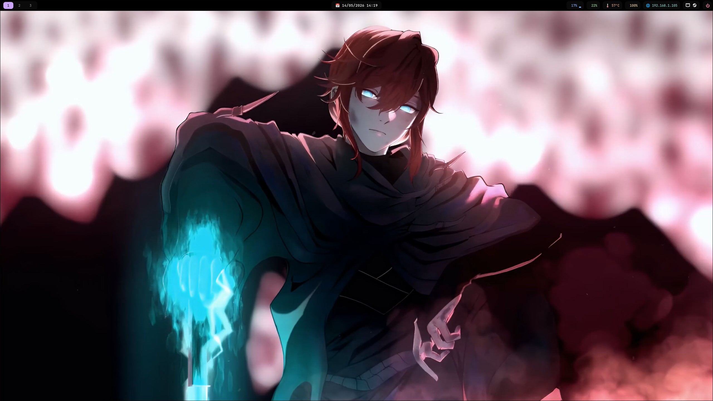
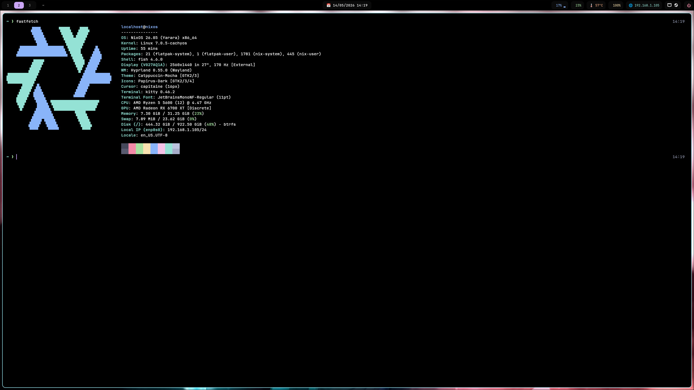

# 🚀 NixOS Hyprland + VFIO

<p align="center">
  ⚡ Declarative • 🎮 Gaming • 🧪 VFIO • 🐧 NixOS
</p>

<p align="center">
  
  
  <br/>
  Built for ultra-low latency Linux gaming and single-GPU virtualization.
</p>

---

AMD-optimized declarative gaming setup featuring:

- Hyprland Wayland desktop
- Low-latency gaming stack
- Hardware-agnostic Reflex / Anti-Lag 2
- Single-GPU VFIO passthrough
- Fully declarative NixOS configuration

> ⚠️ Advanced setup — intended for users familiar with NixOS, Wayland, virtualization and Linux system internals.

---

# ✨ Features

## ⚙️ Kernel & System

- CachyOS BORE kernel
- AMD optimized boot parameters:
  - `amd_pstate=active`
  - `amd_iommu=on`
  - `iommu=pt`
  - `amdgpu.ppfeaturemask=0xfffd7fff`
- Desktop responsiveness tuning:
  - `rcupdate.rcu_expedited=1`
  - `nowatchdog`
  - `nmi_watchdog=0`
- AppArmor enabled
- systemd initrd
- dbus-broker

### BORE Scheduler

Improves:
- desktop responsiveness
- frame pacing
- input latency
- scheduling under gaming load

---

# 🎮 Gaming Stack

## Core

- Steam
- Proton-GE
- Heroic Games Launcher
- MangoHud
- Gamescope
- GameMode
- ProtonUp-Qt

## Low Latency Layer

Hardware-agnostic Vulkan latency layer:

- Global Reflex support
- NVIDIA spoofing for compatibility
- Vulkan injection layer

```bash
# Sistem genelinde (configuration.nix'de zaten ayarlı):
LOW_LATENCY_LAYER_REFLEX=1
```

> **Düzelten (2026-10-04):** Upstream'in okuduğu değişkenler tam olarak üç
> tanedir (`src/layer_context.hh:52-61`): `LOW_LATENCY_LAYER_REFLEX`,
> `LOW_LATENCY_LAYER_SPOOF_NVIDIA`, `LOW_LATENCY_LAYER_FORCE_DECOUPLED`.
> **`LOW_LATENCY_LAYER` diye bir değişken yoktur** — 1.2.0'da
> `configuration.nix`'e eklenen `LOW_LATENCY_LAYER = "1"` satırı hiçbir kod
> tarafından okunmuyordu, sessiz bir no-op'tu. Kaldırıldı.

> **Düzelten (2026-10-03):** Bu katman `948a561` rev'ine sabitlenmiş ve
> upstream manifestinde `enable_environment` **yoktur** — yani varsayılan olarak
> **açıktır**. Repodaki özel manifest `ENABLE_LOW_LATENCY_LAYER` ekliyordu;
> o değişken hiçbir yerde set edilmediği için Vulkan loader katmanı sessizce
> atlıyor, Reflex/Anti-Lag hiç çalışmıyordu. Artık upstream'in kendi
> manifesti (cmake `install` kuralı) kullanılıyor.
>
> **Not:** `LOW_LATENCY_LAYER_SPOOF_NVIDIA` **sistem genelinde ayarlanmaz.**
> Upstream bunu "birçok uygulamanın Reflex seçeneğini göstermesi için
> gerekli" diye belgeler ama yeni sürümlerde `DXVK_CONFIG="dxgi.hideAmdGpu = True"`
> alternatifini öneriyor. Oyun bazında gerekiyorsa Steam başlatma seçeneğine
> ekleyin:
>
> ```bash
> PROTON_FORCE_NVAPI=1 LOW_LATENCY_LAYER_REFLEX=1 LOW_LATENCY_LAYER_SPOOF_NVIDIA=1 %command%
> ```

### RADV Anti-Lag

> **Düzelten (2026-10-03):** `RADV_ANTILAG=1` kaldırıldı. Bu bir Mesa değişkeni
> değil; pinned low_latency_layer rev'i `VK_AMD_anti_lag` uzantısını **kendi
> sunar**, ayrı bir ortam değişkenine gerek yok.

### Vulkan Tweaks

```bash
AMD_VULKAN_ICD=RADV
RADV_PERFTEST=gpl
```
> **Düzelten (2026-10-03):** `nggc` kaldırıldı — NGG culling GFX10.3'te
> (RX 6700 XT) Mesa'da zaten varsayılan olarak açık, bayrak etkisizdi.

### lsfg-vk

Vulkan frame generation support.

---

# 🖥️ Hyprland Desktop

- Hyprland (nixpkgs `nixos-unstable`, **0.56.2**)
- Wayland-only environment
- greetd + tuigreet
- Waybar
- Dunst
- Rofi
- Hypridle
- Hyprlock
- mpvpaper

```ini
allow_tearing = true
vrr = 2
```

---

# 🔊 Audio

PipeWire low-latency:

- 48kHz
- quantum = 128
- ALSA / Pulse / JACK support
- WirePlumber
- rtkit

---

# 💾 Storage

## LUKS2 + Btrfs

- Full disk encryption
- Snapper snapshots
- Monthly scrub
- zram swap

### Subvolumes

- `@`
- `@home`
- `@nix`
- `@log`
- `@snapshots`

---

# 🤖 AI Integration

- Ollama (ROCm acceleration)
- Local LLM support

---

### WuWa Otomatik Çeviri — İlk Kurulum

`SUPER+Y` toggle'ı `wuwa-gemma` Ollama modelini kullanır. Model otomatik indirilmez (yaklaşık 8 GB). İlk kullanımdan önce terminalde çalıştır:

    sudo systemctl start wuwa-gemma-init.service
    ollama list | grep wuwa-gemma

**Not:** `argos-translate` nixpkgs'ta yok → script her zaman Ollama'ya düşer. Yavaş ama çalışır.

**Manuel OCR çeviri** için `SUPER+SHIFT+T` kullan (bu `translate-shell` kullanır, ek kurulum gerekmez).

---

# 🖥️ VFIO / GPU Passthrough

Single-GPU passthrough setup:

### VM Start
- stop display manager
- unbind amdgpu
- bind vfio-pci
- launch VM

### VM Stop
- rebind amdgpu
- restart display manager

> Host screen will go black during passthrough (expected)

---

# 🔒 Security

- AppArmor
- Firewall enabled
- Fail2ban
- SSH key-only auth
- Root login disabled

---

# 🧪 Tested Hardware

| Component | Model |
|----------|------|
| CPU | AMD Ryzen 5 5600 |
| GPU | AMD Radeon RX 6700 XT |
| RAM | 32GB DDR4 |
| Storage | NVMe SSD |

---

# ⚡ Quick Start

```bash
# 1) Repoyu klonla
git clone https://github.com/kUmutUK/nixos-hyprland-vfio.git
cd nixos-hyprland-vfio

# 2) ⚠️ install.sh hemen çalıştırılamaz. Önce KURULUM.md'yi takip et:
#    - Disk bölümleme (LUKS + Btrfs)     → KURULUM.md §1-6
#    - hardware-configuration.nix        → KURULUM.md §7
#    - hashedPassword + SSH anahtarı     → KURULUM.md §8
#    - nixos-install                     → KURULUM.md §9
#
# 3) Mevcut NixOS'u güncelliyorsan (sıfırdan kurulum DEĞİL):
chmod +x install.sh
./install.sh
# → UUID'leri hardware-configuration.nix'te kontrol et
# → /home/.snapshots alt hacmi var mı doğrula

# 4) Rebuild + reboot
sudo nixos-rebuild dry-activate --flake /etc/nixos/nixos#nixos
sudo nixos-rebuild switch --flake /etc/nixos/nixos#nixos
sudo reboot   # ZORUNLU (iommu=pt, amd_iommu=on) 
```

> **Düzelten (2026-10-03):** README bu yolu `/etc/nixos#nixos` gösteriyordu,
> `KURULUM.md` ise `/etc/nixos/nixos#nixos` diyordu — ikisi çelişiyordu.
> `install.sh` dosyaları artık **düz `/etc/nixos/` altına değil**,
> `${NIXOS_DIR}/nixos` (= `/etc/nixos/nixos`) altına kopyalıyor; flake de
> orada. Doğru yol **her iki dokümanda da** `/etc/nixos/nixos#nixos`.

---

# 📁 Repository Structure

```text
.
├── nixos/                       # flake burada → /etc/nixos/nixos#nixos
│   ├── configuration.nix
│   ├── hardware-configuration.nix
│   ├── home.nix                 # masaüstü config'lerinin TEK kaynağı
│   ├── flake.nix
│   ├── flake.lock
│   └── hooks/qemu               # VFIO hook
├── vm-xml/win10.xml
├── assets/                      # ekran görüntüleri (wall-.png, kitty-.png)
├── install.sh
├── shell.nix
├── CHANGELOG.md
├── CONTRIBUTING.md
├── KURULUM.md
├── LICENSE
└── README.md
```

> **Düzelten (2026-10-03):** `.config/`, `waybar/`, `gtk/`, kökteki
> `conf.toml` / `MangoHud.conf` / `*.json` kopyaları **silindi**. Bunlar
> `home.nix` içindeki inline kopyalarla drift etmişti ve hiç deploy edilmiyordu.
> `home.nix` tek doğruluk kaynağıdır; CI de bunları geri getirmeye çalışan
> bir regresyon kontrolü içerir.

---

# 📚 Documentation

- README.md (English)
- KURULUM.md (Turkish)
- CONTRIBUTING.md

---

# 🕹️ Usage

```bash
mangohud gamemoderun gamescope -f -- %command%
```

```bash
LOW_LATENCY_LAYER_SPOOF_NVIDIA=1 %command%
```

```bash
virt-manager
```

---

# 🛠️ Development

```bash
# DÜZELTME (2026-10-04): flake'e gerçek `devShells.x86_64-linux.default`
# eklendi; README'deki `nix develop` artık boşa çalışmıyor. Kökteki
# `shell.nix` legacy <nixpkgs> channel import ettiği için NIX_PATH gerektiriyor.
cd nixos && nix develop

# NixOS config'ini değerlendir (ağır, kernel derlemesi yapabilir):
cd nixos && nix eval .#nixosConfigurations.nixos.config.system.build.toplevel.drvPath
```

### 🖥️ VM'yi tanıt

`vm-xml/win10.xml` repoda duruyor ama **otomatik kurulmuyor** — atlanırsa
domain tanımsız kalır, VFIO hook'unun `$GUEST = "win10"` filtresi hiç
eşleşmez ve GPU hiçbir zaman `vfio-pci`'ye geçmez:

```bash
sudo cp vm-xml/win10.xml /var/lib/libvirt/
sudo virsh define /var/lib/libvirt/win10.xml
virsh list --all        # 'win10' → "shut off" olarak görünmeli
```

> Not: `nix flake check` CI'da **kullanılmıyor** — Hyprland türetmesi
> `--no-build` modunda kendi `VERSION` dosyasını `readFile` ile okuyup
> patlıyor. Yerelde de `nix flake check` yerine yukarıdaki `nix eval`
> komutunu kullanın: CI ile birebir aynı kontrolü yapar (modül sistemini
> gerçekten değerlendirir, build çalıştırmaz) ve `nix flake show`'un
> aksine bozuk option'ları yakalar.

---

# ✅ Validation

```bash
# 1) CI ile aynı kontrol (modül sistemini gerçekten değerlendirir)
cd nixos && nix eval .#nixosConfigurations.nixos.config.system.build.toplevel.drvPath

# 2) Gerçek aktivasyon denemesi
sudo nixos-rebuild dry-activate --flake .#nixos
```

---

# ⚠️ Notes

- hardware-configuration.nix machine-specific
- GPU PCI IDs must be updated
- VFIO disables host display temporarily
- **Sıfırdan kurulumda `localhost` hesabının şifre dosyası gerekir.**
  `configuration.nix` → `hashedPasswordFile = "/etc/nixos/hashedPassword"`.
  Dosya `.gitignore`'da tutulmuyor ve `nixos-install` yokluğunda hata
  vermiyor; activation'da sadece uyarı basıp hesabı `!` (kilitli) bırakıyor.
  `KURULUM.md` §8'e gerekli `mkpasswd` komutu eklendi.
- **SSH varsayılan olarak kapalıdır.** `PasswordAuthentication = false` +
  boş `authorizedKeys.keys` → uzaktan giriş yok. Reboot öncesi kendi
  `ssh-ed25519` anahtarınızı `configuration.nix`'teki listeye ekleyin
  (aksi halde SSH ile geri dönüş yolunuz yok).
- **Hyprland ABI tutarlılığı:** Hyprland ailesi (compositor, hyprlock,
  hypridle, hyprpicker, hyprpolkitagent, xdg-desktop-portal-hyprland)
  artık **tek bir nixpkgs rev'inden** geliyor. 1.2.1'de compositor overlay
  ile 0.55.0'a zorlanırken istemciler 0.54.3'e derlenmişti (0.54 ABI →
  0.55 compositor); bu sürümde overlay kaldırıldı.
- **`qemu.runAsRoot = false`** olduğu için `libvirtd-qemu-ownership`
  oneshot servisi her boot'ta `/var/lib/libvirt/{images,qemu}` sahipliğini
  `qemu-libvirtd:qemu-libvirtd` yapar. Bu olmazsa `virsh start win10`
  "Permission denied" ile başlamaz.
- SSH uses key authentication. `configuration.nix` ships with an **empty**
  `authorizedKeys.keys` — add your own (`ssh-ed25519 …`). Earlier versions
  shipped the maintainer's public key, which granted remote access to anyone
  who installed this config.

---

# 🚧 Known Limitations

### AMD GPU reset bug (RX 6000 series)

The single-GPU passthrough hook (`nixos/hooks/qemu`) attempts a generic
PCI/vendor-specific reset when the VM shuts down. This reliably works for
GPUs officially supported by [gnif/vendor-reset](https://github.com/gnif/vendor-reset)
(Polaris, Vega10/20, Navi 10/12/14 — i.e. the 5000 series and older).

**Navi 21/22/23 (RX 6000 series, including the RX 6700 XT this repo was
tested on) is not in that supported list**, and in practice some of these
cards still exhibit reset-bug-like symptoms (black screen, GPU dropping off
the PCIe bus) on the second VM start. There is currently no universal
software fix for this on Navi2x — reported community workarounds involve
vendor-specific VBIOS reflashing, which is risky and hardware-specific, so
it is intentionally **not** automated here.

The hook now logs (`/var/log/libvirt/vfio.log`) whether the reset actually
succeeded, so a failed reset is visible instead of silently swallowed. On
`release`, if the quiet unbind/rebind doesn't restore a real driver to the
GPU, the hook automatically falls back to a community-reported recovery
trick: `remove` the device from the PCI tree entirely, briefly suspend the
host to RAM via `rtcwake` (auto-wakes after a few seconds), then `rescan`
the bus so the device re-enumerates and binds normally. This works for some
Navi2x boards where a plain reset doesn't; it isn't guaranteed for every
board/VBIOS combination. If the host display still doesn't come back after
this, a full host reboot is the safe fallback.

---

# 📄 License

MIT License

---

# 👤 Maintainer

kUmutUK
